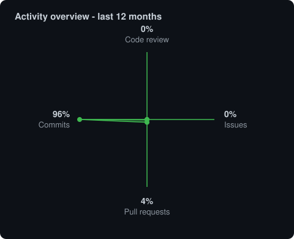

# Ricardo Ariel Anariba

**IT Specialist**

[🇪🇸 Español](README.md) · [🇬🇧 English](README.en.md)

**Tegucigalpa, Honduras 🇭🇳**

## Profile

Software Development Specialist with more than a decade of experience in enterprise systems, backend development, data platforms, infrastructure, and software architecture.

I combine hands-on development with the design and administration of databases, Data Warehouses, integrations, reporting systems, and backend services. I have more than **6 years of specialized experience** in data, integration, and Business Intelligence; my current focus is distributed systems, cloud infrastructure, and scalable services.

> Much of my previous professional work was developed in private or enterprise GitLab repositories. This profile presents my current public portfolio and does not represent the full history of my professional contributions.

## Technical specializations

- **Backend:** REST APIs, microservices, modular systems, and event-driven architecture.
- **Data and BI:** database administration, modeling, and optimization; ETL, Data Warehousing, reporting, and analytics.
- **DevOps:** containers, orchestration, Rancher Community, messaging, deployment, and observability.
- **Frontend and mobile:** web interfaces with Angular, React, Vite, and Next.js; cross-platform mobile applications with Flutter.
- **Agile technical work:** Scrum, sprint planning, requirements analysis, and coordination.

## Public labs

Practical exercises for exploring performance, video processing, autoscaling, and service architecture.

| Lab | Description | Technologies |
| --- | --- | --- |
| [Video Server Benchmark](https://github.com/raanariba/benchmarkVideoServer) | Performance and architecture comparison for video-processing services. | NestJS · FastAPI · Python · TypeScript |
| [Video Server — NestJS](https://github.com/raanariba/videoServerNestjs) | Video-processing and conversion experiment built with NestJS. | NestJS · TypeScript · Node.js |
| [Video Server — FastAPI](https://github.com/raanariba/videoServerFastAPI) | Alternative implementation for comparing HLS video-conversion technologies. | Python · FastAPI |
| [Kubernetes & KEDA Lab](https://github.com/raanariba/videoServerKedaKubernetesLab) | Event-driven autoscaling and container-orchestration lab. | Kubernetes · KEDA · Docker · RabbitMQ |

## Technology stack

**Backend**

**Additional experience:** `C++` · `Visual FoxPro` · `Visual Basic .NET (VB.NET)` · `Pascal`

**Databases and data engineering**

`SQL Server` · `CouchDB` · `ETL` · `Data Warehouse` · `SSRS` · `Power BI` · `KNIME` · `Pentaho`

**DevOps and infrastructure**

`Rancher Community`

**Frontend and mobile**

## Training

`MySQL Databases` · `Scrum Master — PROMESYS` · `Business Intelligence — New Horizons` · `Power BI — USAID` · `Web Applications with Django` · `Angular Development — Coursera` · `Kubernetes Workshop` · `DevOps Training` · `BPMN` · `Process Auditing`

## GitHub activity

